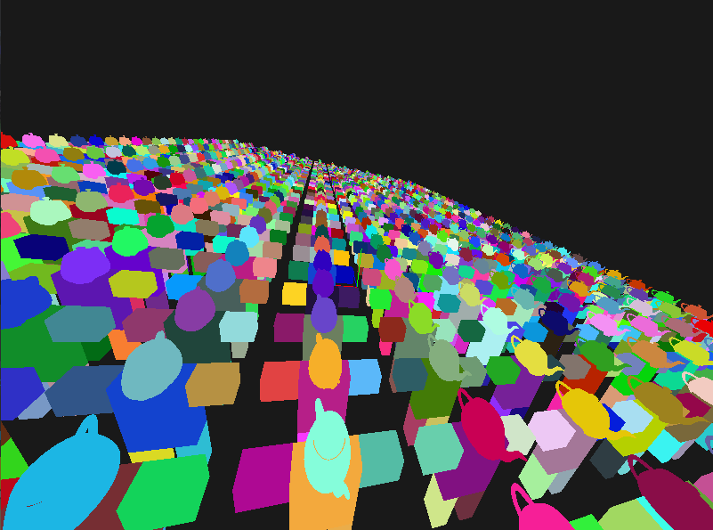

## OpenGL Assignment 2 for Computer Graphics ##
This is the second assignment for for CS 4701 Computer Graphics at Kent State University.
It is windows only 64 bit only.

To build, just start visual studio 2019 and build for either debug or release mode.
If you reciever an error, such as cannot find windows 10 sdk, or cannot find platform toolset (v142),
then you need to edit the solution, so that it matches your version of windows. 

If the glut .dll files aren't automatically copied over by visual studio, you need to manually copy them into the x64 binary folder.

### Pictures

